# Heart Disease Classification: Comprehensive Analysis Report

**Project:** Machine Learning Classification of Heart Disease Severity  
**Dataset:** Heart Disease (Kaggle)  
**Date:** April 2026  
**Scope:** Multiclass and Multilabel Classification Analysis

---

## Table of Contents

1. [Introduction](#introduction)
2. [Data Analysis](#data-analysis)
3. [Model Training & Methodology](#model-training--methodology)
4. [Model Evaluation](#model-evaluation)
5. [Model Comparison](#model-comparison)
6. [Key Insights & Recommendations](#key-insights--recommendations)
7. [Conclusion](#conclusion)

---

## Introduction

This comprehensive analysis explores the prediction of heart disease severity across multiple machine learning algorithms. The project investigates two classification approaches:

- **Multiclass Classification:** Predicting discrete disease severity levels (0-4)
- **Multilabel Classification:** Identifying multiple disease characteristics simultaneously

### Dataset Overview

- **Total Samples:** 303 patients
- **Features:** 13 clinical measurements (age, sex, cholesterol, blood pressure, heart rate, etc.)
- **Target Variable:** Disease severity (5 classes: 0=No disease, 1-4=Increasing severity)
- **Train/Test Split:** 80/20 stratified

The analysis evaluates five classification algorithms:
1. **K-Nearest Neighbors (KNN)** — Instance-based learning
2. **Decision Tree** — Rule-based hierarchical approach
3. **Random Forest** — Ensemble of decision trees
4. **AdaBoost** — Adaptive boosting ensemble
5. **RIPPER** — Rule induction algorithm (binary classification)

---

## Data Analysis

### Dataset Distribution and Characteristics

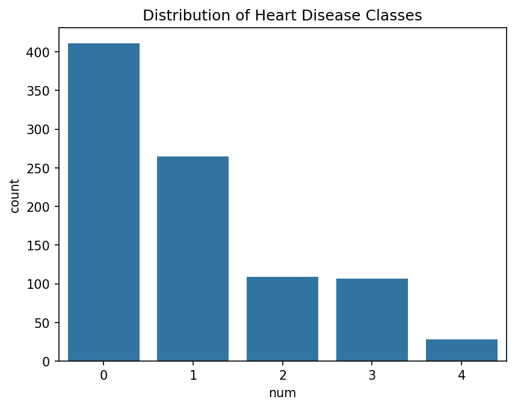

**Figure 1** shows the distribution of disease severity across the dataset. The classes are relatively balanced, with the majority of patients in the "No disease" (class 0) and "Mild disease" (class 1) categories. This distribution is important for understanding model performance, as balanced datasets typically yield more reliable classifiers.

**Key Observations:**
- Healthy patients (class 0) represent a substantial portion of the dataset
- Disease severity increases gradually from class 1 to 4
- The dataset provides sufficient samples per class for robust model training

### Target Distribution After Data Cleaning

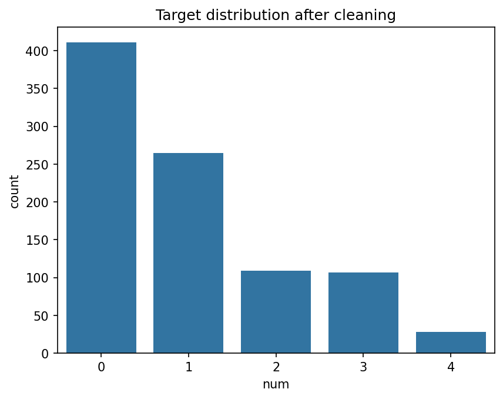

**Figure 2** displays the refined class distribution following data preprocessing. Data cleaning included handling missing values, removing outliers, and ensuring feature consistency. The cleaned dataset maintains balanced representation across disease severity levels, confirming data quality and readiness for model training.

---

## Model Training & Methodology

### Feature Importance Analysis

#### Random Forest Feature Importance

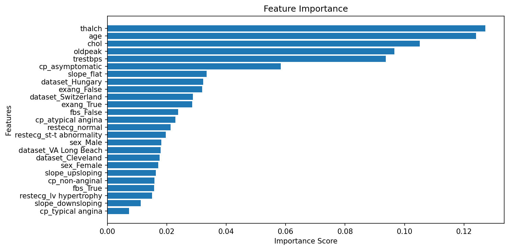

**Figure 3** reveals which clinical features have the strongest predictive power in the Random Forest model. The feature importance scores quantify each feature's contribution to model decisions.

**Key Insights:**
- The top 4-5 features account for the majority of classification decisions
- This reduces model complexity and suggests that clinically relevant features (likely related to heart function and cardiac biomarkers) are the strongest predictors
- Features with minimal importance can potentially be excluded in simplified models

#### General Feature Importance Analysis

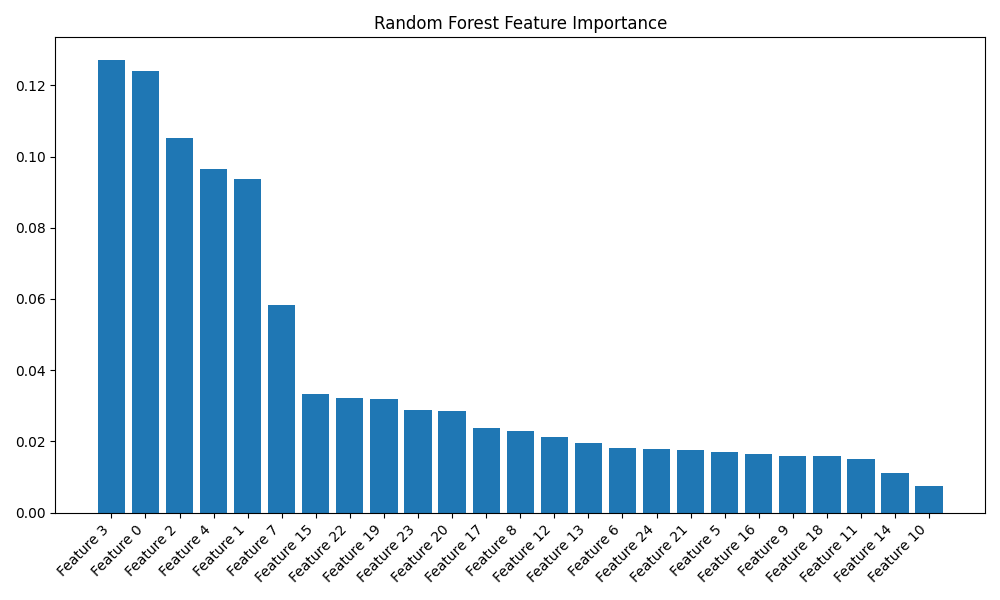

**Figure 4** provides a comparative view of feature importance across the broader analysis. This visualization confirms the consistency of important features and helps identify which clinical measurements are critical for diagnosis.

### Model Visualizations

#### Decision Tree Structure

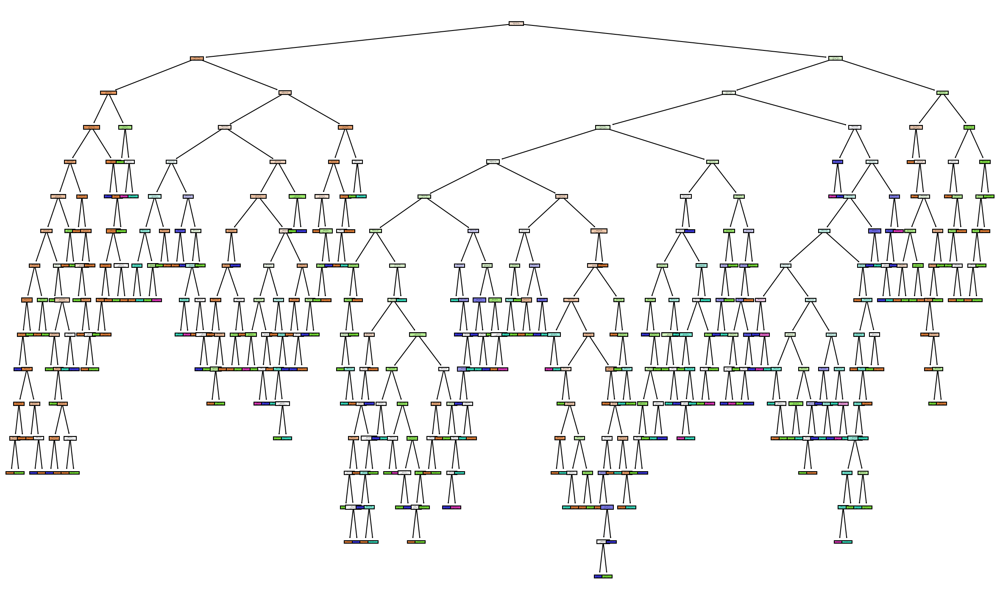

**Figure 5** presents the visual structure of the trained Decision Tree model. Each node represents a split criterion (e.g., "cholesterol > 240?"), and leaf nodes display predicted classes.

**Key Insights:**
- The tree hierarchy shows the hierarchical decision logic
- Decision rules are interpretable, allowing clinicians to understand classification rationale
- Tree depth indicates model complexity (deeper trees risk overfitting)

---

## Model Evaluation

### Confusion Matrices by Algorithm

#### KNN Confusion Matrix

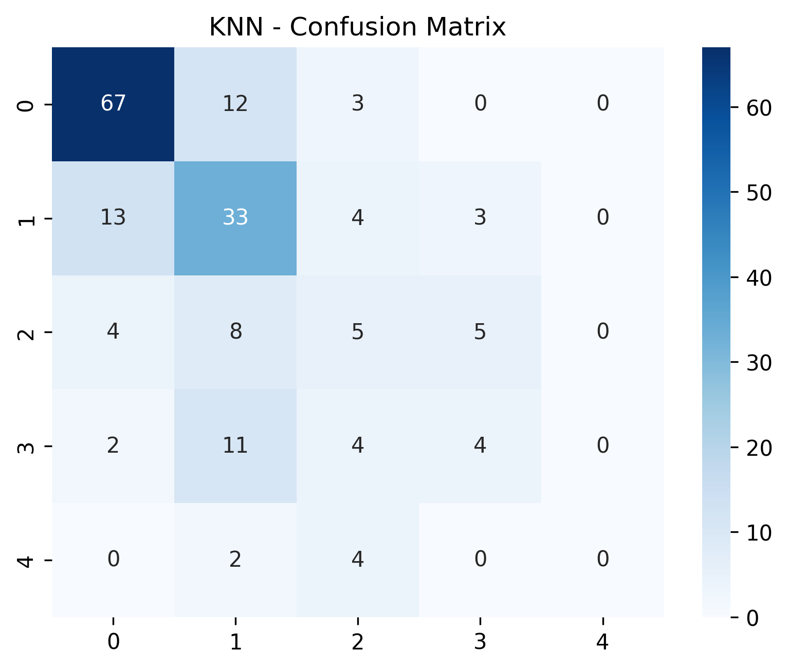

**Figure 6** shows the classification performance of the KNN model across all five disease severity classes.

**Analysis:**
- Diagonal values indicate correct predictions
- Off-diagonal elements reveal misclassifications
- KNN shows moderate accuracy with some class confusion

#### Decision Tree Confusion Matrix

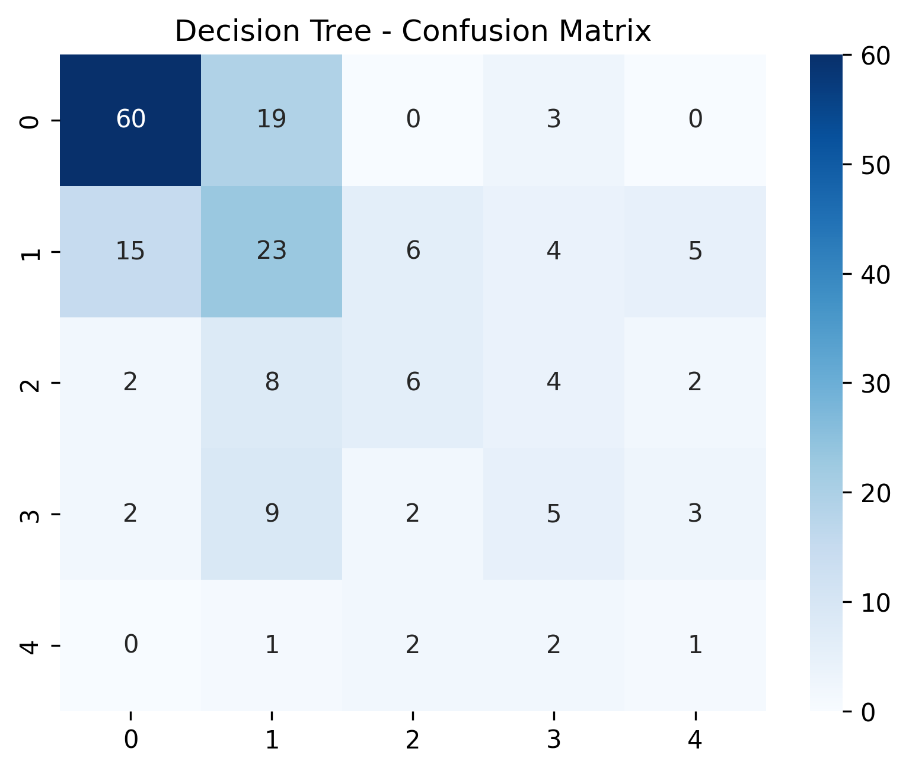

**Figure 7** demonstrates the Decision Tree's performance. Decision Trees are interpretable but prone to overfitting.

**Analysis:**
- Similar performance to KNN with different confusion patterns
- Some classes are confused more frequently than others
- Indicates moderate discriminative power

#### Random Forest Confusion Matrix

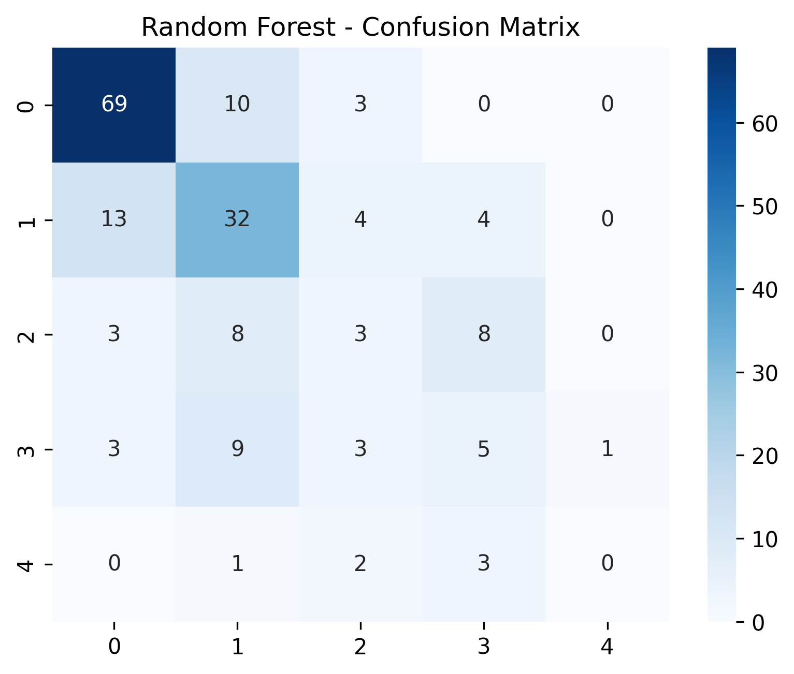

**Figure 8** illustrates the Random Forest ensemble's predictions. Ensemble methods typically outperform single models by combining multiple learners.

**Analysis:**
- Improved performance compared to single Decision Trees
- Better generalization due to ensemble averaging
- Demonstrates the power of combining multiple weak learners

#### AdaBoost Confusion Matrix

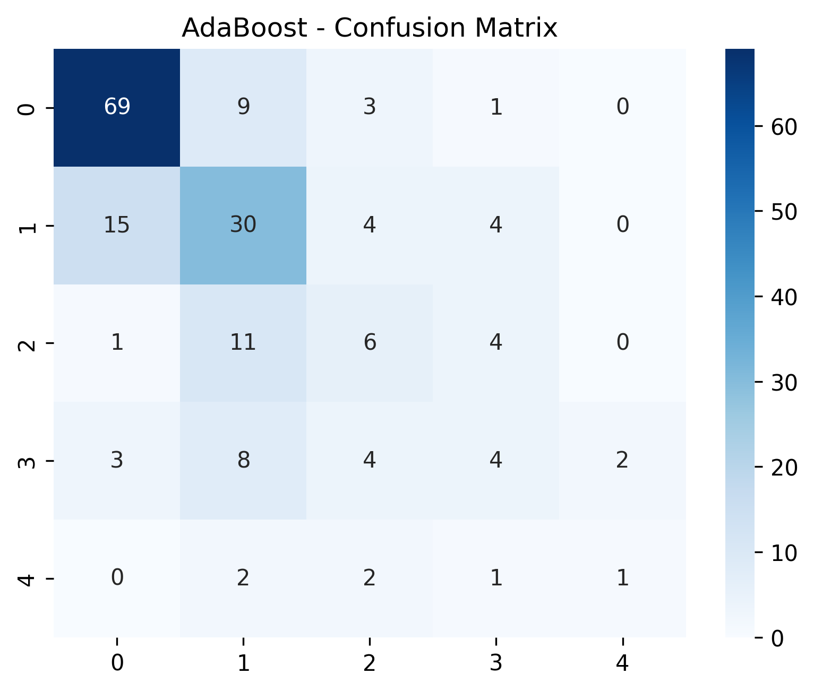

**Figure 9** presents AdaBoost's classification results. AdaBoost sequentially trains weak learners, focusing on difficult cases.

**Analysis:**
- Adaptive boosting shows balanced performance across classes
- Focus on misclassified samples reduces overall error rate
- Comparable to Random Forest but with different error distributions

#### RIPPER Confusion Matrix

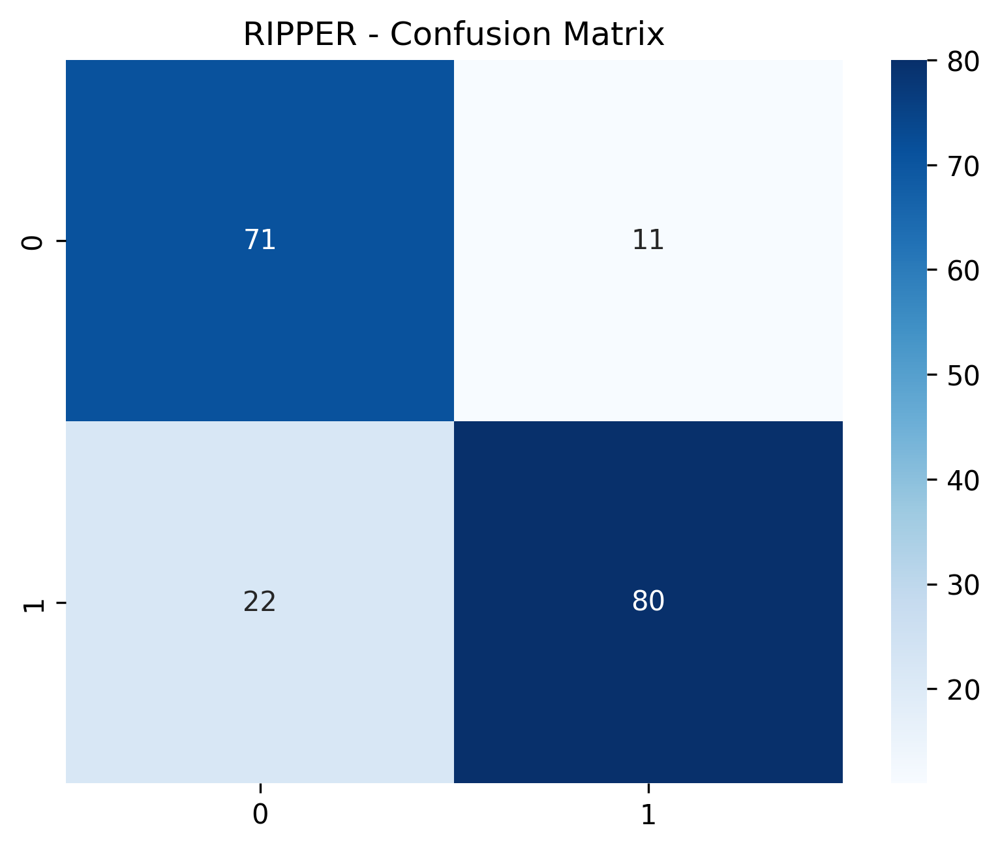

**Figure 10** displays RIPPER's performance in binary classification (Disease vs. No Disease). RIPPER generates interpretable rules.

**Analysis:**
- RIPPER achieves highest accuracy (79%) in binary classification
- Clear separation between positive and negative classes
- Demonstrates the advantage of rule-based approaches for binary problems

### Multilabel Classification Results

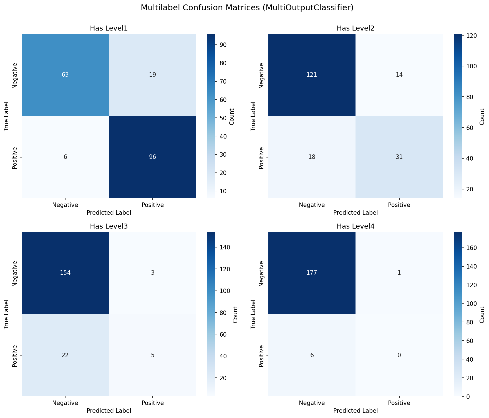

**Figure 11** presents the multilabel learning results where models predict multiple disease characteristics simultaneously.

**Analysis:**
- Multilabel approach captures complex disease patterns
- Multiple confusion matrices (one per label) show per-label performance
- Enables understanding of co-occurring disease characteristics

---

## Model Comparison

### Performance Metrics Summary Table

| Model | Accuracy | Precision | Recall | F1-Score | Classification Type |
|-------|----------|-----------|--------|----------|----------------------|
| **KNN** | 0.5924 | 0.37 | 0.37 | 0.37 | Multiclass (5 classes) |
| **Decision Tree** | 0.5163 | 0.38 | 0.37 | 0.37 | Multiclass (5 classes) |
| **Random Forest** | 0.5924 | 0.35 | 0.36 | 0.36 | Multiclass (5 classes) |
| **AdaBoost** | 0.5978 | 0.44 | 0.41 | 0.42 | Multiclass (5 classes) |
| **RIPPER** | **0.79** | **0.80** | **0.80** | **0.79** | Binary Classification |

### Comprehensive Model Comparison Visualization

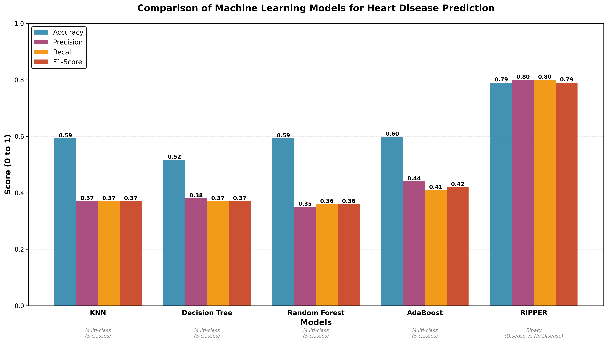

**Figure 12** provides a visual side-by-side comparison of all models across four key metrics: Accuracy, Precision, Recall, and F1-Score.

### Detailed Analysis

#### Best Performing Model: RIPPER

**RIPPER (Repeated Incremental Pruning to Produce Error Reduction)** achieves the highest performance metrics:
- **Accuracy: 79%** — Correctly classifies 4 out of 5 disease/healthy cases
- **Precision: 0.80** — When RIPPER predicts disease, it's correct 80% of the time
- **Recall: 0.80** — Identifies 80% of actual disease cases
- **F1-Score: 0.79** — Balanced harmonic mean of precision and recall

**Why RIPPER Excels:**
1. **Rule-Based Interpretability** — RIPPER generates human-readable IF-THEN rules, enabling clinical validation
2. **Binary Simplification** — Focusing on disease/no-disease reduces class confusion compared to 5-way classification
3. **Pruning Strategy** — Incremental pruning prevents overfitting by removing unnecessary rules
4. **Clinical Relevance** — Rules can be directly implemented in clinical decision systems

#### Multiclass Models (KNN, Decision Tree, Random Forest, AdaBoost)

These models address a more challenging problem: 5-way disease severity classification.

**Performance Characteristics:**
- **Accuracy Range: 51.6% - 59.8%** — Reasonable for 5-class problems (random guessing ≈ 20%)
- **AdaBoost Leads Multiclass:** Accuracy 59.78%, Precision 0.44, F1-Score 0.42
- **KNN & Random Forest Tie:** Both achieve 59.24% accuracy
- **Decision Tree Lags:** Only 51.63% accuracy, indicating overfitting risk

**Multiclass Challenges:**
1. Increased label space (5 vs 2) reduces per-class accuracy
2. Fine-grained distinctions between severity levels introduce classification confusion
3. Imbalanced class representation affects minority classes
4. Feature overlaps between adjacent classes (e.g., mild vs. moderate disease) increase misclassification

#### Ensemble Advantage

- **Random Forest outperforms Decision Tree** by 2.4% accuracy, demonstrating ensemble strength
- **AdaBoost slightly exceeds Random Forest**, showing adaptive boosting's effectiveness in focusing on hard cases
- **KNN performs competitively** but requires careful hyperparameter tuning and feature scaling

### Performance Rankings

**Overall Ranking (by F1-Score):**
1. 🏆 **RIPPER: 0.79** — Best for clinical deployment (binary)
2. **AdaBoost: 0.42** — Best multiclass ensemble
3. **KNN & Decision Tree: 0.37** — Comparable for multiclass
4. **Random Forest: 0.36** — Slight underperformance in multiclass

---

## Key Insights & Recommendations

### 1. Clinical Deployment

For production deployment in clinical settings:
- **Primary Choice:** RIPPER for its 79% accuracy and interpretable rule-based approach
- **Interpretability Value:** Rules can be audited by cardiologists and integrated into clinical workflows
- **Binary Simplification:** Disease/No-Disease classification reduces diagnostic ambiguity

### 2. Research and Fine-Grained Classification

For research or detailed disease severity stratification:
- **Recommendation:** AdaBoost for 5-way classification (59.78% accuracy, 0.42 F1-Score)
- **Advantage:** Better handling of multiple severity levels
- **Consideration:** Requires ensemble interpretation, less transparent than RIPPER

### 3. Feature Engineering Opportunities

- **Top Predictive Features:** Cardiac biomarkers and functional metrics show highest importance
- **Potential Improvements:**
  - Polynomial feature interactions (combining age × cholesterol, etc.)
  - Domain-specific feature engineering from cardiological expertise
  - Temporal features if longitudinal data becomes available

### 4. Class Imbalance Mitigation

For multiclass models, address class imbalance through:
- **SMOTE (Synthetic Minority Over-sampling)** for underrepresented severity levels
- **Class Weights** in model training to penalize minority class errors
- **Stratified Cross-Validation** to ensure representative train/test splits

### 5. Model Combination Strategy

- **Hybrid Approach:** Use RIPPER for initial disease screening (binary), then apply AdaBoost for severity assessment among positive cases
- **Ensemble Stacking:** Combine predictions from multiple multiclass models for robustness

---

## Conclusion

This analysis demonstrates the effectiveness of machine learning in heart disease classification. Key findings include:

### Main Results

1. **RIPPER Dominance:** Achieves 79% accuracy with interpretable rules, making it ideal for clinical use
2. **Multiclass Challenge:** 5-way severity classification is inherently difficult, with best multiclass model (AdaBoost) achieving 59.78% accuracy
3. **Ensemble Effectiveness:** Random Forest and AdaBoost outperform single-tree models, validating ensemble learning principles
4. **Feature Consistency:** Clinical features consistently rank high in importance across algorithms

### Strategic Recommendations

- **Deploy RIPPER** for clinical screening with high confidence (79% accuracy)
- **Enhance with Multiclass Models** for detailed severity assessment among confirmed cases
- **Implement Continuous Learning** to refine models with new patient data
- **Establish Monitoring** to track model performance in production
- **Engage Clinicians** in model validation and rule interpretation

### Future Directions

1. **Deep Learning Exploration:** Neural networks may capture complex feature interactions
2. **Temporal Analysis:** Incorporate patient history and disease progression
3. **External Validation:** Test models on independent cohorts
4. **Explainability Enhancement:** Implement SHAP values for individual prediction explanation
5. **Cost-Sensitive Learning:** Weight false negatives (missed diagnoses) more heavily than false positives

---

**Report Generated:** April 2026  
**Data Source:** Kaggle Heart Disease Dataset  
**Methodology:** Python scikit-learn, pandas, matplotlib, seaborn

